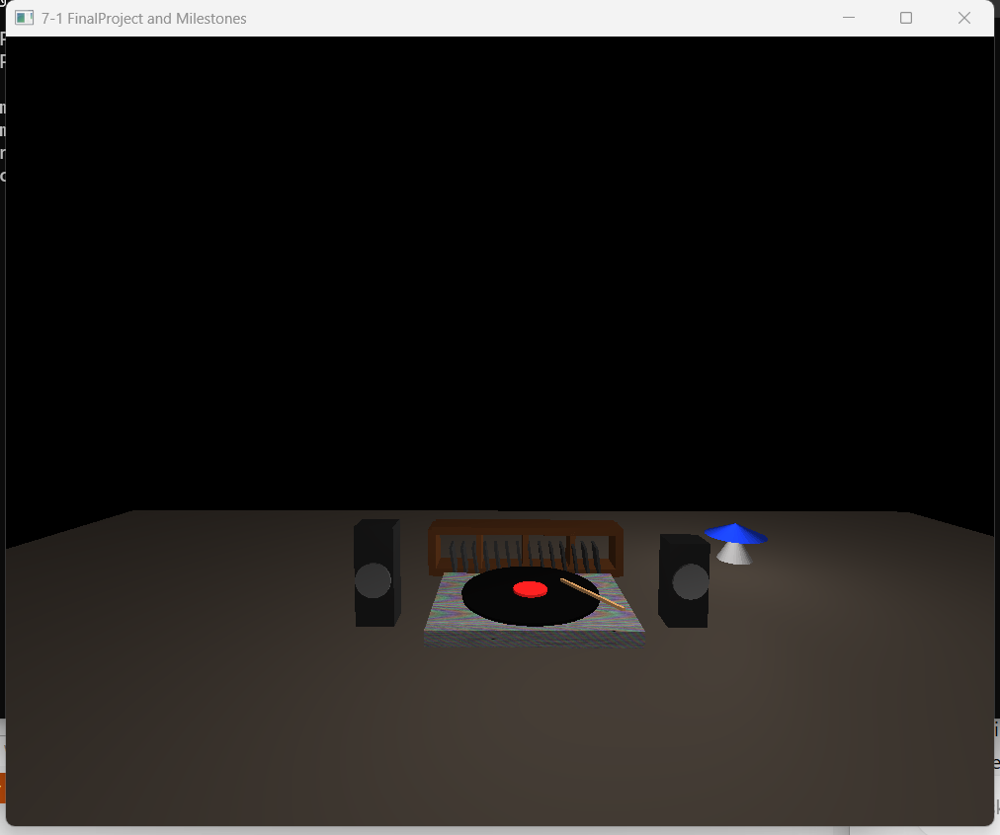

# 3D Music Listening Room

## Overview

The 3D Music Listening Room is an interactive computer graphics project built with C++ and OpenGL. The project creates a music-themed 3D environment using geometric primitives, textures, lighting, transformations, and interactive camera controls.

The final scene includes a record player with a vinyl record and tonearm, speakers, vinyl storage, and a floor lamp. The project demonstrates how multiple graphics programming concepts can be combined to construct and navigate a complete 3D scene.

## Features

- Interactive 3D environment
- Keyboard and mouse camera controls
- Perspective and orthographic projection modes
- Multiple light sources
- Texture mapping
- Object transformations
- Reusable geometric meshes
- Material and lighting properties
- Real-time scene rendering

## Scene Objects

The scene includes:

- Record player
- Vinyl record and record label
- Tonearm
- Left and right speakers
- Vinyl storage shelf
- Individual records stored on the shelf
- Floor lamp
- Textured wood surfaces

## Camera Controls

The scene can be explored using keyboard and mouse input:

- **W / S** – Move forward and backward
- **A / D** – Move left and right
- **Q / E** – Move down and up
- **Mouse movement** – Look around the scene
- **Mouse wheel** – Adjust camera movement speed
- **P** – Switch to perspective projection
- **O** – Switch to orthographic projection
- **Escape** – Close the application

## Technologies

- C++
- OpenGL
- GLSL shaders
- GLFW
- GLEW
- GLM
- Visual Studio
- STB Image

## Scene Design

The listening room is constructed from reusable geometric primitives including planes, boxes, cylinders, cones, and toruses.

Objects are created by scaling, rotating, and positioning these meshes within the scene. For example, cylinders are used to construct the vinyl record and speaker components, while boxes are used for the record player base, speakers, shelving, and individual records.

A wood texture is applied to the record player base to add visual detail to the scene.

## Lighting

The scene uses multiple light sources to create a more realistic atmosphere.

A warm primary light illuminates the main scene, while a blue accent light is positioned near the floor lamp. Material properties define ambient, diffuse, and specular lighting behavior for rendered objects.

## Technical Decisions

The project separates major graphics responsibilities into dedicated components.

`SceneManager` handles scene preparation, textures, materials, lighting, object transformations, and rendering.

`ViewManager` manages the display window, camera movement, mouse input, keyboard controls, and projection modes.

Reusable geometric meshes are transformed and combined to construct more complex objects rather than modeling each object as a unique mesh. This approach keeps the scene modular and makes individual objects easier to position and modify.

## Challenges and Solutions

One of the primary challenges was positioning and scaling multiple geometric primitives so they appeared as recognizable objects within the same 3D environment.

Breaking complex objects into smaller geometric components made the scene easier to construct and debug. Camera controls also made it possible to inspect the scene from different positions while adjusting object placement.

Lighting and texture mapping required coordinating shader values, material properties, texture loading, and object rendering. Separating these responsibilities into reusable functions made the rendering process easier to manage.

## Skills Demonstrated

- C++ programming
- OpenGL graphics programming
- 3D transformations
- Texture mapping
- Lighting and materials
- Camera transformations
- Perspective and orthographic projections
- Keyboard and mouse input
- GLSL shaders
- Object-oriented programming
- Software debugging

## Project Structure

- `3D-Music-Listening-Room.sln` – Visual Studio solution
- `3D-Music-Listening-Room.vcxproj` – Visual Studio project configuration
- `MainCode.cpp` – Application entry point and rendering loop
- `SceneManager.cpp` / `SceneManager.h` – Scene construction, textures, lighting, materials, and rendering
- `ViewManager.cpp` / `ViewManager.h` – Camera, input, window, and projection management
- `textures/wood.jpg` – Wood texture used within the scene
- `3D-Music-Listening-Room.png` – Screenshot of the completed scene

## Running the Project

This project was developed using Visual Studio and OpenGL.

To run the project:

1. Open `3D-Music-Listening-Room.sln` in Visual Studio.
2. Verify that the required OpenGL dependencies and supporting project files are available.
3. Build the solution.
4. Run the application.
5. Use the keyboard and mouse controls to navigate the scene.

## Project Screenshot

## What I Learned

This project strengthened my understanding of how a 3D graphics application is built from multiple interconnected components. I gained experience combining geometry, transformations, textures, materials, lighting, shaders, and camera controls into a complete interactive scene.

I also gained experience debugging graphical applications by isolating individual components and adjusting object transformations, lighting values, camera behavior, and texture configuration.

Building recognizable objects from simple reusable meshes helped me better understand how complex 3D scenes can be constructed from relatively simple geometric components.

## Potential Enhancements

Future improvements could include:

- Additional textures and materials
- More detailed scene objects
- Animated components
- Dynamic lighting controls
- Additional environmental details
- More advanced shader effects
